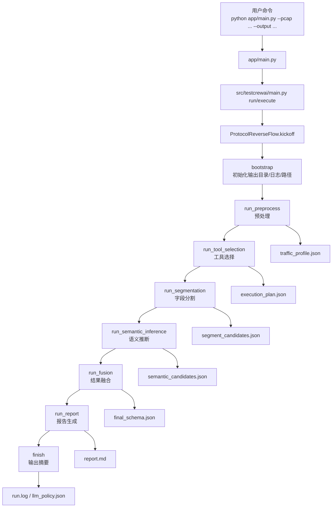
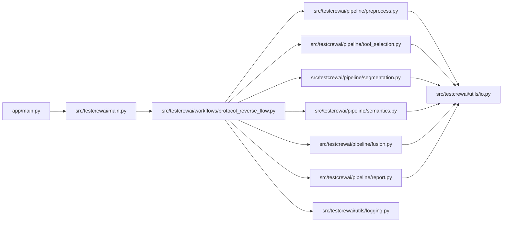
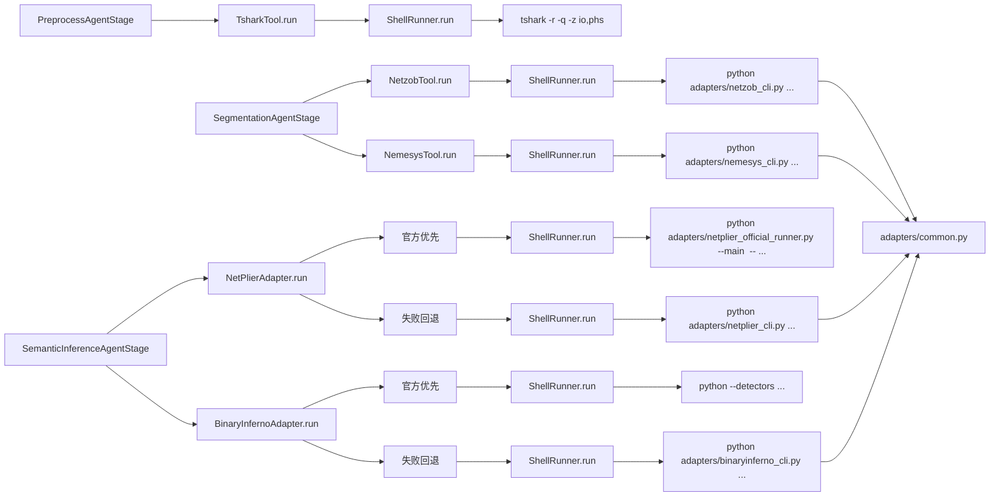

# 协议逆向系统执行流程与调用关系图

本文档用于说明本项目从 CLI 启动到结果落盘的完整调用链，包括：

- 各阶段执行顺序
- 各文件之间的调用关系
- tools/adapters 的子进程执行关系
- 每阶段输入/输出产物

## 1. 端到端执行流程（Flow 主链路）

## 2. 文件级调用关系（主流程）

## 3. Tools 与 Adapters 调用图（子进程层）

## 4. 各阶段输入与输出

| 阶段 | 主要输入 | 主要调用文件 | 主要输出 |
|---|---|---|---|
| bootstrap | CLI 参数 | `workflows/protocol_reverse_flow.py` | 初始化状态、日志路径、产物路径 |
| preprocess | `pcap/pcapng` | `pipeline/preprocess.py` | `traffic_profile.json` |
| tool_selection | `traffic_profile.json`（内存对象） | `pipeline/tool_selection.py` | `execution_plan.json` |
| segmentation | `traffic_profile.json` + `execution_plan.json` | `pipeline/segmentation.py` + `tools/protocol_tools.py` | `segment_candidates.json` |
| semantics | `segment_candidates.json` + `traffic_profile.json` + `execution_plan.json` | `pipeline/semantics.py` + `tools/protocol_tools.py` | `semantic_candidates.json` |
| fusion | 边界候选 + 语义候选 + profile | `pipeline/fusion.py` | `final_schema.json` |
| report | 所有中间结果 + final schema | `pipeline/report.py` | `report.md` |
| finish | 全部状态 | `workflows/protocol_reverse_flow.py` | 终端摘要、`llm_policy.json`、`run.log` |

## 5. 官方路径与降级路径（关键机制）

- `NetzobTool`：调用 `adapters/netzob_cli.py`，脚本内支持 official/heuristic/auto。
- `NemesysTool`：调用 `adapters/nemesys_cli.py`，支持 official/heuristic/auto。
- `NetPlierAdapter`：先尝试官方 `main.py`（通过 `netplier_official_runner.py`），失败后回退 `netplier_cli.py`。
- `BinaryInfernoAdapter`：先尝试官方 `blackboard.py`，失败后回退 `binaryinferno_cli.py`。
- 所有外部命令最终统一走 `tools/shell_runner.py`，并返回标准结构 `ShellCommandResult`。

## 6. LLM 在系统中的位置（受控参与）

LLM 不直接替代底层统计/解析，而是作为策略层增强：

- 预处理审查：`_apply_llm_preprocess_review`
- 工具选择二次裁决：`_refine_execution_plan_with_llm`
- 融合阶段语义仲裁：`_apply_llm_fusion_arbitration`
- 阶段性说明注释：`_collect_llm_note`

对应文件：`src/testcrewai/workflows/protocol_reverse_flow.py`。

